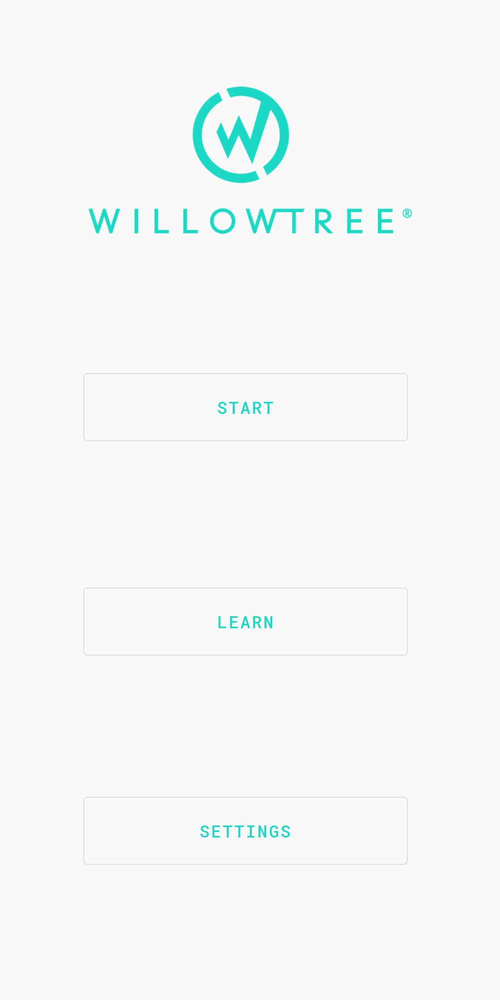
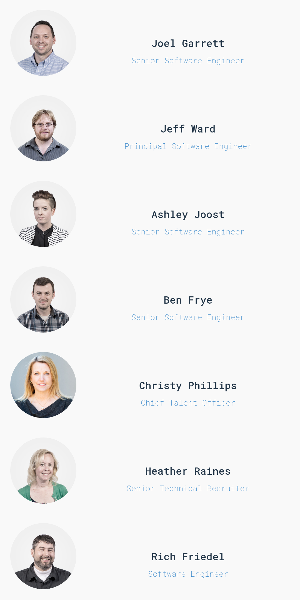
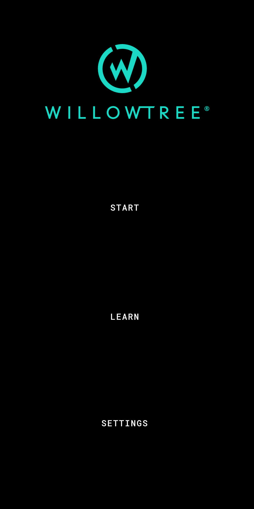

# Name Game
Simple REST application to help Willowtree new hires learn people’s name.

## Purpose
This is a simple game-style android application to help newly hired tree’s to learn others name. The application fetches current employee’s name, title, and photo form Willowtree API.

## Learn
The learn section of this application lists all updated Willowtree employees. This is a great way to learn/get to know your co-workers.

## Train
By hitting the “Start” button, you can try and see if you got it down. Try and match the name on the top with the pictures on the screen. You will proceed to next round if you get it right, or see “X” if you get it wrong. Score is kept at the bottom of the screen.

## Dark mode
Dark mode is a must have for any application these days. You can toggle it on by going to the setting screen from the home screen.

## Libraries
- - - -
This is also a great application to take a look at how many of the modern android component/libraries are used in a relatively simple application.
The technology stack used are:
* Jetpack Navigation Architecture
* Retrofit
* Moshi
* Room
* Glide
* Recyclerview
* Dagger
* RxJava
